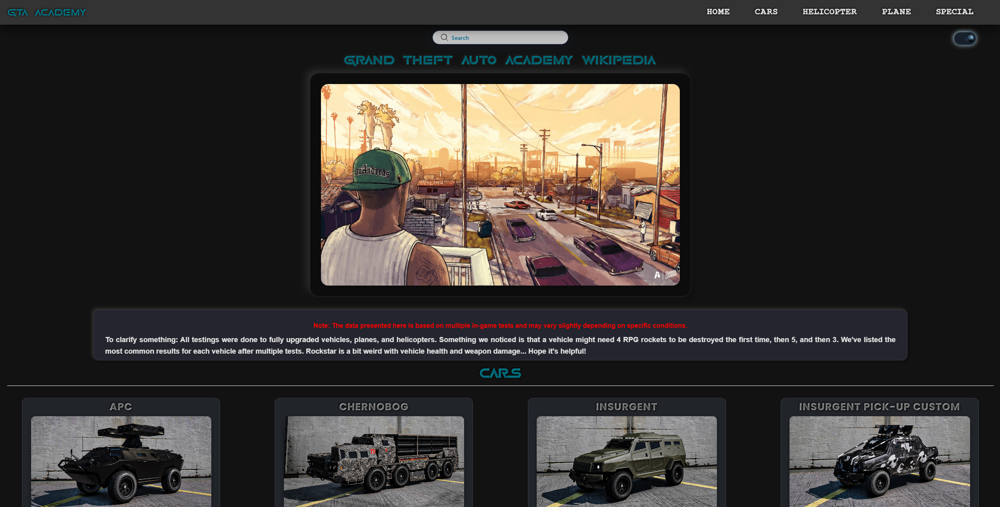

# 🏙️ GTA Academy — In-Game Vehicle Durability Wiki

**GTA Academy** is a stylish and responsive in-game wiki for *Grand Theft Auto V*, focusing on testing and documenting the durability of various vehicles — from cars to helicopters and planes.

Every stat is the result of multiple in-game experiments using fully upgraded vehicles. The data reflects how many hits each vehicle can take from a variety of weapons, such as RPGs, Homing Missiles, Railguns, and more.

## 🔧 Features

- 📊 **Detailed damage stats** for 30+ vehicles (cars, helicopters, planes).
- 🎨 **Dark/Light mode switcher** with animated toggle UI.
- 🔍 **Live search functionality** with dynamic filtering.
- 📱 **Fully responsive layout** optimized for mobile and ultra-mobile screens.
- 💡 **Custom UI/UX** with interactive transitions and hover effects.
- 🧑‍💻 **Contributors:** `Thomas_2873` & `tony_greek`

## 🚀 Technologies Used

- **HTML5**, **CSS3**, **Vanilla JavaScript**
- Modular CSS architecture:  
  - `style.css`, `apperience_mode.css`, `searchbar.css`, `friend.css`, `copyright.css`
- JavaScript features:  
  - Smooth scrolling  
  - Animated scroll-based interactions  
  - LocalStorage theme preference  
  - Mobile breakpoint handling

## 🖼️ Preview

> _Note: All data is tested in-game and may slightly vary due to GTA's physics engine quirks._

---

## 📄 License

This project is for educational and entertainment purposes only.  
© 2024–2025 Thomas_2873 & tony_greek. All rights reserved.

